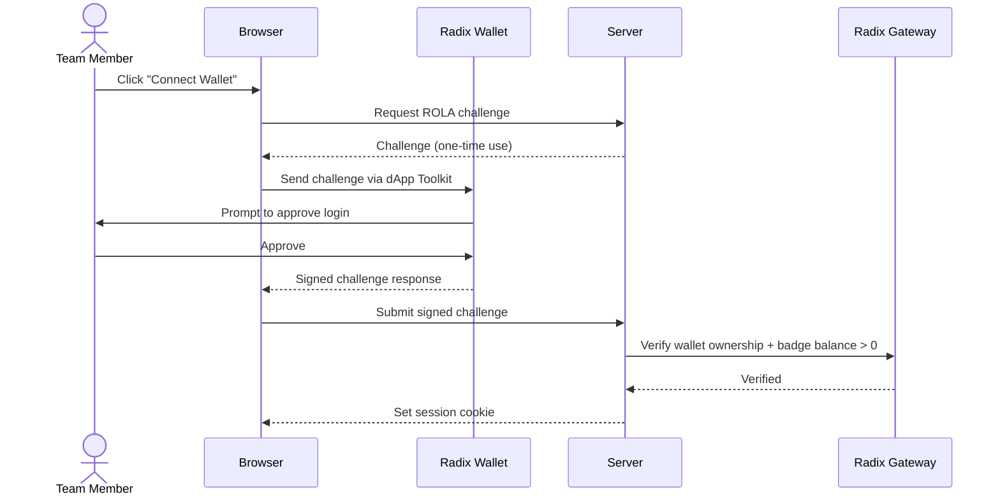
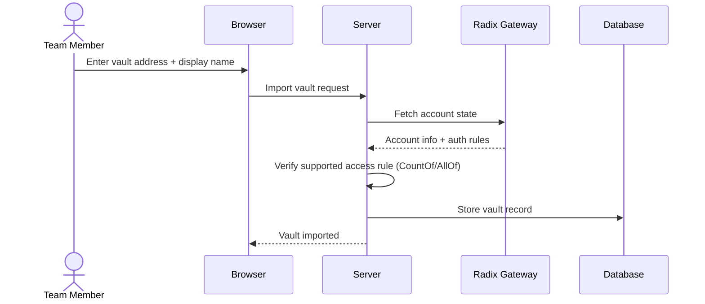
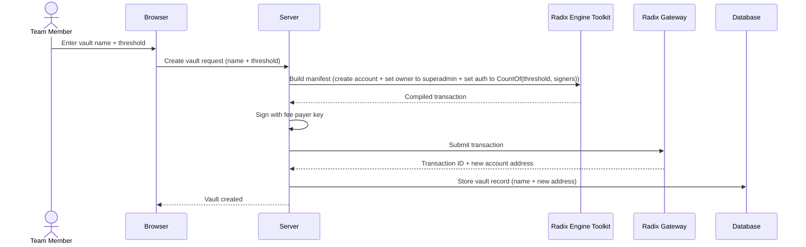
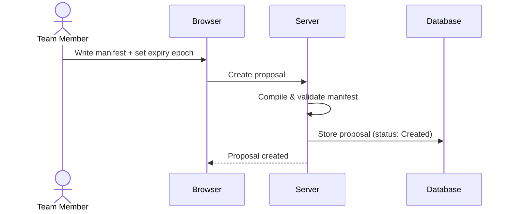
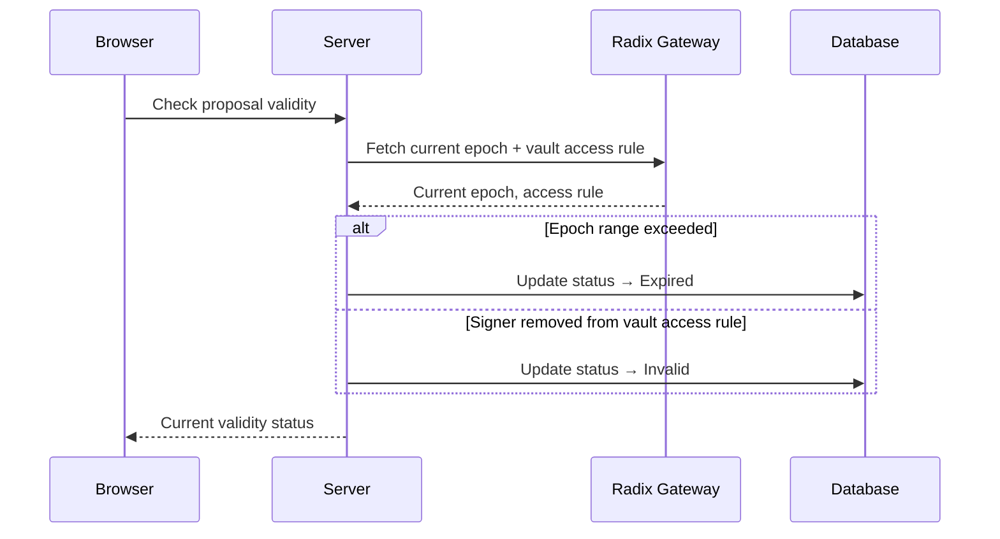
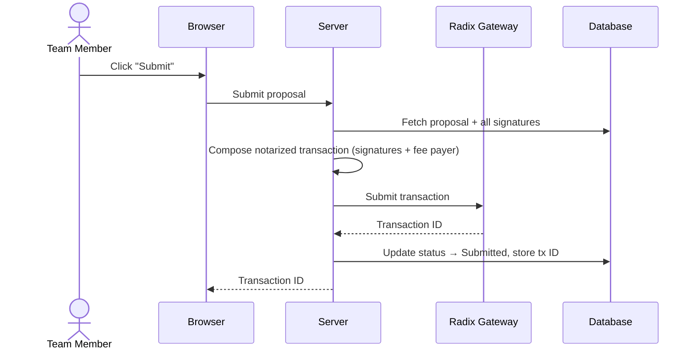
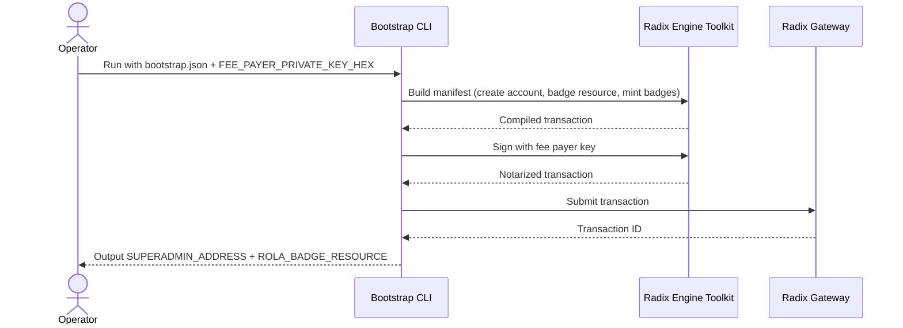

# Multisig Vaults — Product Scope Document

## 1. Overview

**What & Why:**

On Radix, on-chain accounts can hold tokens and other assets. When an organization shares an account, multiple people need to approve transactions (multisig) so no single person can move funds unilaterally. Coordinating this manually — passing around transaction payloads, collecting signatures offline — is painful and error-prone.

- **Vault** — An on-chain Radix account that holds a team's assets, controlled by multisig so transactions require approval from multiple signers before executing.
- **Team** — The set of signers whose public keys are listed in the multisig access rule. They collectively approve all vault transactions via threshold signing (n-of-m).

```
┌─────────────────────────────────────────────────┐
│           Superadmin Account (multisig)          │
│         3-of-3 signers: Alice, Bob, Carol        │
└──────────┬──────────────┬──────────────┬─────────┘
           │ owns         │ owns         │ owns
           │ (can change  │ (can change  │ (can change
           │  rules)      │  rules)      │  rules)
           ▼              ▼              ▼
    ┌─────────────┐ ┌─────────────┐ ┌─────────────┐
    │  Vault A    │ │  Vault B    │ │  Vault C    │
    │  2-of-3     │ │  3-of-3     │ │  1-of-3     │
    │  threshold  │ │  threshold  │ │  threshold  │
    └─────────────┘ └─────────────┘ └─────────────┘
```

Each vault has its own signing threshold. Vault owner roles delegate to superadmin for rule management. All vaults share the same signer set (copied from superadmin), but each can require a different number of signatures.

This product provides a web UI to manage vaults, create transaction proposals, collect threshold signatures via the Radix Wallet, and submit approved transactions — replacing manual coordination with a structured workflow.

**Purpose:** Badge-gated web app for managing shared Radix accounts through a proposal → sign → submit workflow, with per-vault threshold multisig backed by a superadmin account.

**Components:**
1. **Web App** — SPA for vault management, proposal creation, signing, and submission
2. **Server** — Effect RPC backend handling proposal lifecycle, auth, and Radix Gateway communication
3. **Bootstrap CLI** — One-time setup tool to create the superadmin account, badge resource, and initial badges on-chain

**Core Flow:**

```
Setup:      Import or create vault (one-time per vault)

Day-to-day: Badge holder logs in via ROLA → Creates proposal →
            Signers approve via wallet → Threshold met → Submit to Radix network
```

**Tech Stack Summary:**
- Web App: TanStack Start (SPA), React, Tailwind, shadcn/ui, Radix dApp Toolkit
- Server: Effect RPC on `@effect/platform`, PostgreSQL via Drizzle ORM
- CLI: Effect + Radix Engine Toolkit (TypeScript WASM)
- Network: Configurable (Stokenet / Mainnet)

---

## 2. Users & Permissions

| Role | Identification | Capabilities |
|------|---------------|-------------|
| Unauthenticated | No wallet / no badge | Nothing — app is fully badge-gated |
| Team Member | Wallet connected + ROLA account proof + hold member badge (balance > 0) | Log in, view vaults, create proposals, sign proposals, submit proposals |
| Signer | Key listed in a **vault's** access rule | Above + signatures count toward the vault's proposal threshold |

**Authentication:**
- Radix Wallet Connect via dApp Toolkit (ROLA challenge-response)
- Server verifies wallet ownership + badge balance > 0 via Gateway
- Session maintained via HTTP-only cookie

**ROLA Login**



**Authorization Model:**
- Badge ownership = app access (binary: you have it or you don't)
- All vaults share one signer set but each has its own threshold
- No per-vault permissions — any badge holder can create proposals on any vault
- Superadmin signer status is determined on-chain, not in the database

---

## 3. Domain Concepts

### 3.1 Vault

A Radix on-chain account whose **owner role** delegates to the superadmin account (so superadmin can change the vault's rules) and whose **auth role** has a per-vault threshold with the same signers as superadmin — `CountOf(vault_threshold, [superadmin signers])`. Vaults can be added to the app in two ways: **imported** by providing an existing account address and display name (any parseable access rule accepted), or **created** on-chain by the server with a specified threshold (signers copied from superadmin's current signer set, transaction fees paid by the server fee payer key). No multisig approval is needed for vault creation — the fee payer signs the creation transaction directly.

### 3.2 Proposal

A transaction manifest that requires threshold signatures before it can be submitted. Proposals target a specific vault and go through a defined lifecycle:

```
Created → Signing (first signature received) → Ready (threshold met) →
  → Submitted (sent to network)
  → Expired (epoch range exceeded)
  → Invalid (signer removed from access rule after signing)
  → Failed (transaction rejected by network)
```

A proposal becomes invalid if **the vault's** access rule changes after signatures were collected (e.g., a signer is removed or threshold is changed), reducing valid signatures below threshold.

### 3.3 Signature

A cryptographic approval from a signer on a proposal's subintent. Signatures are collected via Radix Wallet's pre-authorization flow. Each signer can sign a proposal at most once. The server validates that the signer's key hash appears in **the vault's** current access rule.

### 3.4 Superadmin

A multisig account that owns all vaults and manages their access rules. Defined by:
- **Signers** — public keys authorized to approve transactions
- **Threshold** — minimum number of signatures required for superadmin operations (n-of-m)

Manages vault access rules (change thresholds, sync signers) and badge management (mint/burn) alongside its own signer set. Supports **CountOf** (n-of-m) and **AllOf** (all must sign) access rules. Flat rules only — no nested structures.

### 3.5 Badge

A fungible, soul-bound token used as the ROLA authentication gate. Minted via superadmin proposals. Holding any balance > 0 grants app access. The badge resource has mint authority on the superadmin account, so minting/burning requires superadmin threshold approval.

---

## 4. Features

### 4.1 Vault Management

| Action | Description |
|--------|-------------|
| Create vault | Create a new on-chain account with specified `threshold`, signers fetched from superadmin, owner delegated to superadmin; fee payer signs the transaction |
| Import vault | Register an existing on-chain account by address + display name; verify supported access rule (any parseable CountOf/AllOf accepted) |
| List vaults | View all imported vaults (excludes superadmin) |
| View vault | See vault balance, proposal history, current threshold + signers |
| View vault signers | Show vault's current signer set + threshold (fetched from on-chain access rule) |
| Re-sync vault | Manually refresh on-chain state (balances + access rule) |

**Import Vault**



**Create Vault**



### 4.2 Proposal Lifecycle

| Action | Description |
|--------|-------------|
| Create proposal | Write a transaction manifest + set expiry epoch; server compiles, validates, and stores |
| View proposal | See manifest text, status, epoch range, transaction ID (if submitted) |
| List proposals | Filter by vault and/or status |
| Validity check | On-demand: detects epoch expiry or signer-set changes that invalidate signatures |

**Create Proposal**



**Validity Check**



### 4.3 Signing

| Action | Description |
|--------|-------------|
| Sign proposal | Approve via Radix Wallet pre-authorization (subintent signing) |
| View signature progress | See collected vs. required signatures, per-signer status |

The signing flow:
1. Client builds a `SubintentRequest` from proposal metadata (epoch range, discriminator, timestamps, subintent hash)
2. Radix Wallet independently computes the same subintent hash and signs
3. Client sends signed partial transaction back to server
4. Server extracts and validates signature against **vault's** access rule

**Sign Proposal**


### 4.4 Submission

| Action | Description |
|--------|-------------|
| Submit proposal | Compose notarized transaction with fee payer, submit to Gateway |
| View result | Transaction ID + submitted status |

**Submit Proposal**



Submission is idempotent — the Radix network deduplicates by subintent hash. No server-side polling; the user checks transaction status via the Radix Dashboard or explorer.

### 4.5 Superadmin Operations

| Action | Description |
|--------|-------------|
| View signers | Current signer list + threshold (fetched from on-chain state) |
| View badge resource | Badge resource address |
| Mint badge | Create a proposal on the superadmin vault to mint a badge to a specified account |
| Burn/revoke badge | Create a proposal to burn a badge from a specified account |
| Change signers | Create a proposal to modify the superadmin access rule (add/remove signers, change threshold) |
| Change vault threshold | Create a proposal on superadmin to change a vault's auth rule (threshold or signers) |
| Re-sync | Refresh superadmin on-chain state |

All superadmin operations (mint, burn, signer changes) go through the standard proposal → sign → submit flow on the superadmin vault.

---

## 5. Pages & UI

### 5.1 Route Map

| Page | Route | Key Actions |
|------|-------|-------------|
| Dashboard | `/` | View vault list + pending proposal counts |
| Add Vault | `/vaults/add` | Import existing vault by address or create new vault on-chain (with threshold input; signers auto-fetched from superadmin) |
| Vault Detail | `/vaults/$vaultId` | View balance, current threshold + signers, browse proposals (filterable by status), create proposal |
| Create Proposal | `/vaults/$vaultId/proposals/new` | Write manifest text, set expiry epoch, submit |
| Proposal Detail | `/vaults/$vaultId/proposals/$proposalId` | View status, manifest, signature progress; sign or submit |
| Superadmin | `/superadmin` | View signers + threshold, badge resource, vault threshold management, re-sync |
| Badge Management | `/superadmin/badges` | Mint badge (enter recipient), burn/revoke badge |
| Signer Management | `/superadmin/signers` | View current signers, create proposal to change access rule |
| Superadmin Proposals | `/superadmin/proposals` | List proposals for badge mints, signer changes |

### 5.2 Layout

- **Sidebar navigation:** Vault list, superadmin section, connected wallet info
- **Wallet connect button:** Triggers ROLA login flow
- **Responsive:** Desktop-first with basic mobile support

### 5.3 Key UI Elements

| Component | Purpose |
|-----------|---------|
| Manifest Editor | Textarea for entering transaction manifest text |
| Signature Progress | Progress bar + per-signer status table (signed / pending) |
| Status Badge | Colored indicator for proposal status (created, signing, ready, submitted, etc.) |
| Balance Display | Token balances for a vault account |

---

## 6. CLI Bootstrap Tool

### 6.1 Purpose

One-time setup tool that creates the on-chain infrastructure needed before the web app can operate.

### 6.2 Inputs

**Configuration file (`bootstrap.json`):**
- `networkId` — Stokenet (2) or Mainnet (1)
- `signers` — Array of initial signer public keys + key types
- `threshold` — Required signature count
- `initialBadgeRecipients` — Account addresses to receive initial badges

**Environment variable:**
- `FEE_PAYER_PRIVATE_KEY_HEX` — Key used to pay transaction fees during bootstrap

### 6.3 Steps

1. Create superadmin multisig account with specified signers + threshold
2. Create soul-bound fungible badge resource with mint authority on superadmin
3. Mint initial badges to specified recipient accounts

**Bootstrap**



### 6.4 Outputs

Environment variable values for the server and client:
```
SUPERADMIN_ADDRESS=account_tdx_2_1...
ROLA_BADGE_RESOURCE=resource_tdx_2_1...
```

---

## 7. Success Criteria

### 7.1 Functional Requirements

| Requirement | Acceptance |
|-------------|-----------|
| Badge-gated access | Only users holding the ROLA badge can log in |
| Add vault | User can import an existing on-chain account (any parseable access rule) or create a new vault on-chain with specified threshold; app stores the record |
| Create proposal | User can submit a manifest; server compiles, validates, and stores the proposal |
| Sign proposal | Signer can approve via Radix Wallet; signature is validated and recorded |
| Threshold detection | System correctly identifies when enough valid signatures are collected against the per-vault threshold |
| Submit transaction | Fully-signed proposal is composed with fee payer and submitted to Gateway |
| Validity checking | Expired proposals and invalidated signatures are detected on demand |
| Superadmin management | Badge minting/burning and signer changes work through the standard proposal flow |
| Bootstrap CLI | Creates superadmin account, badge resource, and initial badges in one run |

### 7.2 Non-Functional Requirements

| Requirement | Target |
|-------------|--------|
| Network support | Stokenet and Mainnet via configuration; separate deployment per network, configured via `NETWORK_ID` env var |
| Wallet support | Radix Wallet via dApp Toolkit |
| Idempotent submission | Re-submitting the same proposal does not create duplicates |
| Session security | HTTP-only cookies, server-side sessions, single-use ROLA challenges |
| Fee payer | Dedicated account with small XRD balance, manual top-up |

---

## 8. Out of Scope (MVP)

| Item | Reason |
|------|--------|
| Pagination | Not needed for MVP scale |
| Server-side rendering (SSR) | SPA-only for simplicity |
| Transaction status polling | User checks status via Radix Dashboard; server returns tx hash only |
| Nested access rules | Only flat CountOf/AllOf supported; no AnyOf or nested structures |
| Per-vault signer sets | All vaults share superadmin signers; only thresholds differ per vault |
| Real-time updates | Manual re-sync buttons instead of WebSocket/SSE push |
| Automated fee payer top-up | Manual XRD funding of fee payer account |
| Audit log | No history of who signed or when beyond current proposal state |

---

## 9. Open Questions

| Question | Impact | Notes |
|----------|--------|-------|
| Fee payer funding | Ops | How is the fee payer account initially funded and monitored for low balance? |
| Vault removal | Data model | Can vaults be removed from the database, or only archived? |
| Manifest templates | UX | Should the app provide pre-built manifest templates for common operations (transfers, staking)? |
| Proposal expiry notification | UX | Should the app warn users when proposals are approaching epoch expiry? |
| Access rule migration | Superadmin | When superadmin signers change, vault auth rules become stale (still have old signer set). Should vaults auto-sync, or require manual re-sync? In-flight proposals may also be invalidated. |
