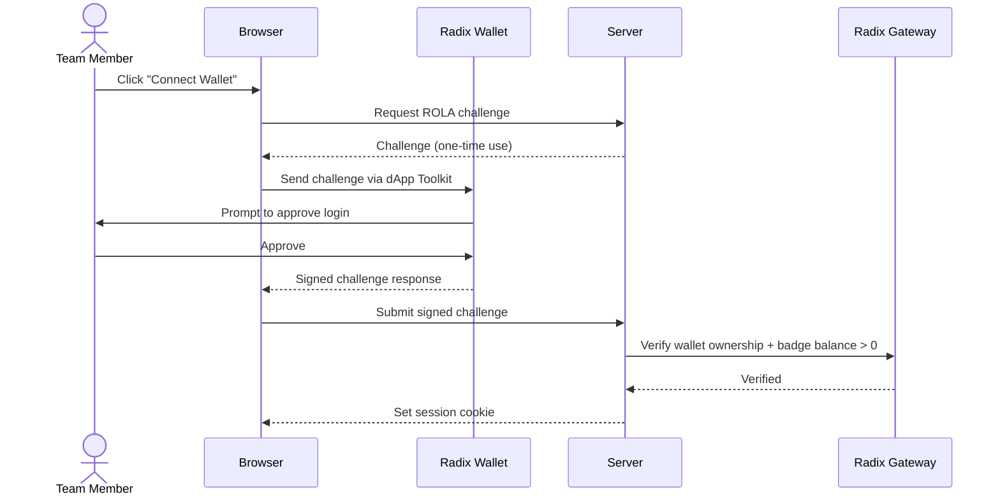
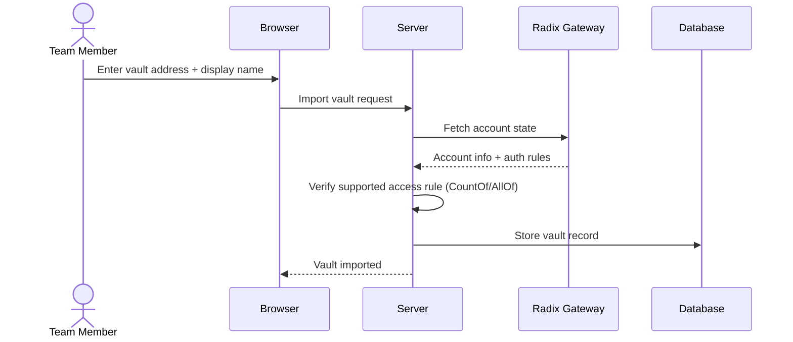
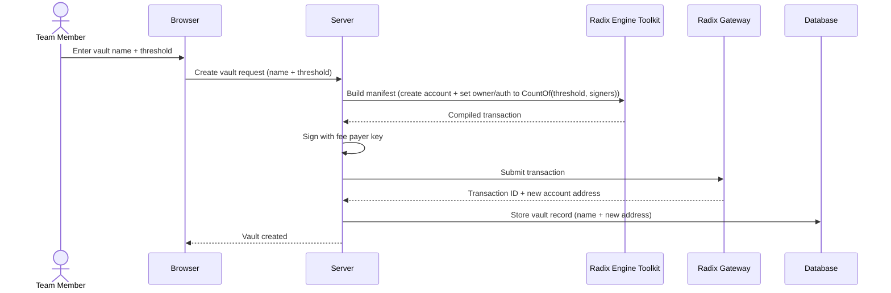
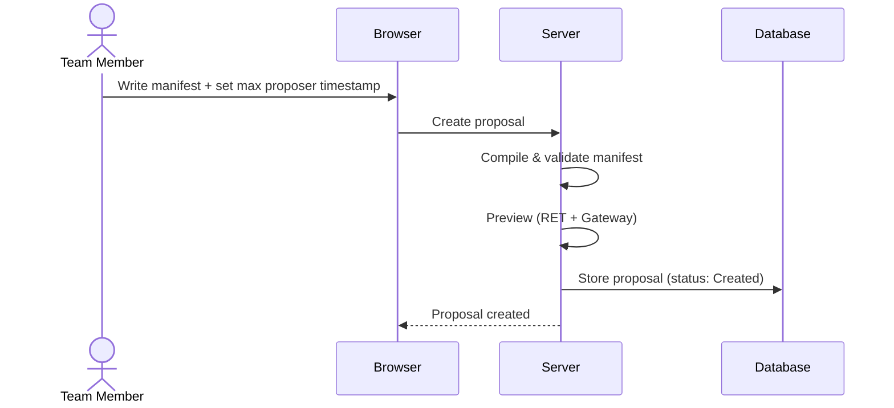
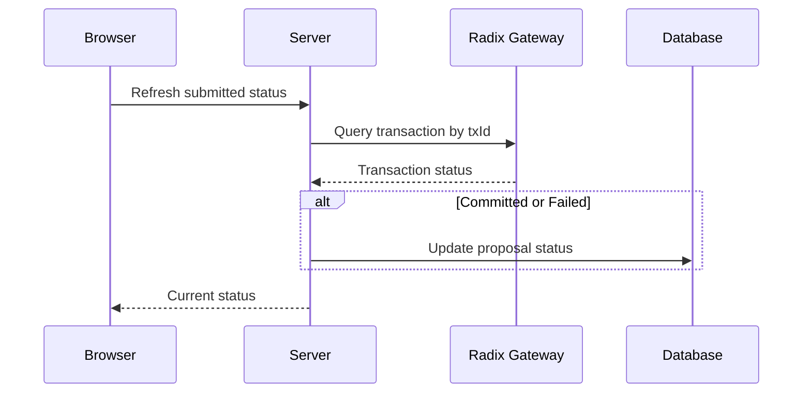
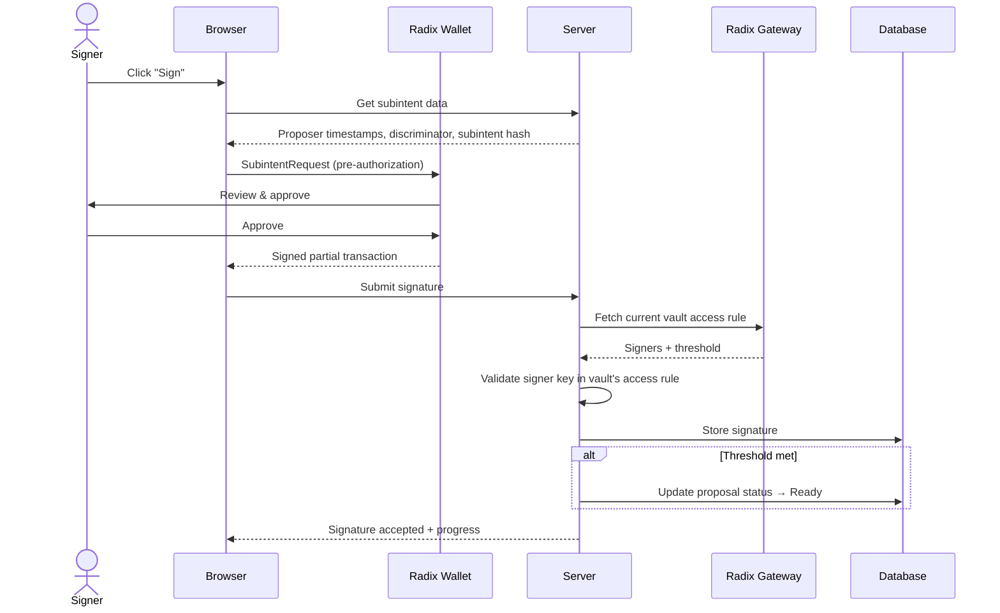
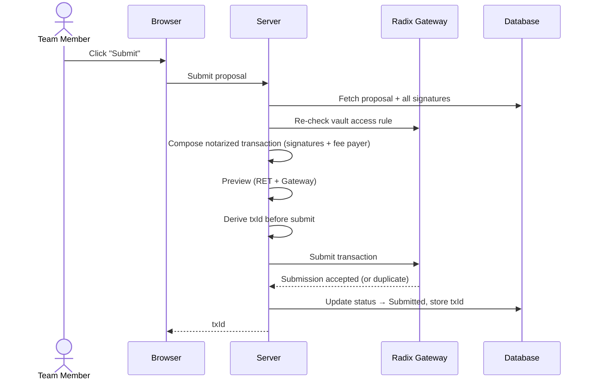
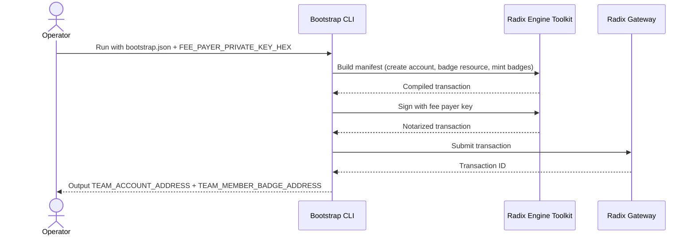

# Multisig Vaults — Product Scope Document

## 1. Overview

**What & Why:**

On Radix, on-chain accounts can hold tokens and other assets. When an organization shares an account, multiple people need to approve transactions (multisig) so no single person can move funds unilaterally. Coordinating this manually — passing around transaction payloads, collecting signatures offline — is painful and error-prone.

- **Vault** — An on-chain Radix account that holds a team's assets, controlled by multisig so transactions require approval from multiple signers before executing.
- **Team** — Badge-holding members who can perform write actions in the app. Vault signers are resolved from each vault's on-chain access rule.

```
┌─────────────────────────────────────────────────┐
│ Team Account (badge ops only: mint/recall/burn) │
└─────────────────────────────────────────────────┘

┌─────────────┐ ┌─────────────┐ ┌─────────────┐
│  Vault A    │ │  Vault B    │ │  Vault C    │
│  2-of-3     │ │  3-of-5     │ │  1-of-2     │
│ signers A   │ │ signers B   │ │ signers C   │
└─────────────┘ └─────────────┘ └─────────────┘
```

Each vault has its own independent signer set and threshold. Team membership controls who can perform write actions in the app, while vault-local multisig rules control which signatures count for a given vault proposal.

This product provides a web UI to manage vaults, create transaction proposals, collect threshold signatures via the Radix Wallet, and submit approved transactions — replacing manual coordination with a structured workflow.

**Purpose:** Web app for managing shared Radix accounts through a proposal → sign → submit workflow, with independent per-vault multisig and badge-gated write actions.

**Components:**
1. **Web App** — SPA for vault management, proposal creation, signing, and submission
2. **Server** — Effect RPC backend handling proposal lifecycle, auth, and Radix Gateway communication
3. **Bootstrap CLI** — One-time setup tool to create the team account, badge resource, and initial badges on-chain

**Core Flow:**

```
Setup:      Import or create vault (one-time per vault)

Day-to-day: Badge holder logs in via ROLA → Creates proposal →
            Signers approve via wallet → Threshold met → Submit to Radix network
```

**Tech Stack Summary:**
- Web App: TanStack Start (SPA), React, Tailwind, shadcn/ui, Radix dApp Toolkit
- Server: Effect RPC on `@effect/platform`, PostgreSQL via Drizzle ORM
- CLI: Effect + Radix Engine Toolkit (TypeScript WASM)
- Network: Configurable (Stokenet / Mainnet)

---

## 2. Users & Permissions

| Role | Identification | Capabilities |
|------|---------------|-------------|
| Unauthenticated | No wallet / no badge | Public read-only access (vaults/proposals/team status views) |
| Team Member | Wallet connected + ROLA account proof + hold member badge (balance > 0) | Log in, perform write actions (create/sign/submit/resync/refresh) |
| Signer | Key listed in a **vault's** access rule | Above + signatures count toward the vault's proposal threshold |

**Authentication:**
- Radix Wallet Connect via dApp Toolkit (ROLA challenge-response)
- Server verifies wallet ownership + badge balance > 0 via Gateway
- Session maintained via HTTP-only cookie

**ROLA Login**



**Authorization Model:**
- Badge ownership = write access (binary: you have it or you don't)
- Reads are public
- Vault signer sets are vault-local and can differ between vaults
- No per-vault app permissions — any badge holder can create proposals on any vault
- Signer status is determined on-chain, not in the database

---

## 3. Domain Concepts

### 3.1 Vault

A Radix on-chain account with a vault-local owner/auth multisig rule (`CountOf`/`AllOf`) and independent signer set. Vaults can be added to the app in two ways: **imported** by providing an existing account address and display name (supported flat `CountOf`/`AllOf` only), or **created** on-chain by the server with a specified threshold and signer set (transaction fees paid by the server fee payer key). No multisig approval is needed for vault creation — the fee payer signs the creation transaction directly.

### 3.2 Proposal

A transaction manifest that requires threshold signatures before it can be submitted. Proposals target a specific vault and go through a defined lifecycle:

```
Created → Signing (first signature received) → Ready (threshold met) →
  → Submitted (sent to network)
  → Committed (network success)
  → Failed (network rejection)
  → Expired (max proposer timestamp exceeded)
  → Invalid (submit-time signer/threshold re-check or preview failure)
```

A proposal becomes invalid when submit-time checks fail (e.g., signer/threshold drift or preview failure). `GetProposal` is read-only and does not mutate validity state.

### 3.3 Signature

A cryptographic approval from a signer on a proposal's subintent. Signatures are collected via Radix Wallet's pre-authorization flow. Each signer can sign a proposal at most once. The server validates that the signer's (`keyType`, `keyHash`) appears in **the vault's** current access rule.

### 3.4 Team Account

A team account used for membership badge operations and team visibility in the app. Team-level signer info is discovered on-chain and shown as a consistency signal relative to derived member signer sets.

### 3.5 Badge

A fungible, soul-bound token used as the write-authorization gate. Holding any balance > 0 grants write access. Team-controlled mint/recall/burn manages membership lifecycle.

---

## 4. Features

### 4.1 Vault Management

| Action | Description |
|--------|-------------|
| Create vault | Create a new on-chain account with specified `threshold` and signer set; fee payer signs the transaction |
| Import vault | Register an existing on-chain account by address + display name; verify supported access rule (any parseable CountOf/AllOf accepted) |
| Change vault auth rules | Create a vault-local proposal that calls `SET_OWNER_ROLE` to update signer set and/or threshold; executes after vault threshold approvals |
| List vaults | View all imported vaults (team account hidden from vault list) |
| View vault | See vault balance, proposal history, current threshold + signers |
| View vault signers | Show vault's current signer set + threshold (fetched from on-chain access rule) |
| Re-sync vault | Manually refresh on-chain state (balances + access rule) |

**Import Vault**



**Create Vault**



### 4.2 Proposal Lifecycle

| Action | Description |
|--------|-------------|
| Create proposal | Write a transaction manifest + set max proposer timestamp (unix ms); server compiles, validates, previews, and stores |
| View proposal | See manifest text, status, proposer timestamp bounds, transaction ID (if submitted) |
| List proposals | Filter by vault and/or status |
| Refresh submitted status | Manual action to reconcile submitted tx state by txId |

**Create Proposal**



**Manual Submission Status Refresh**



### 4.3 Signing

| Action | Description |
|--------|-------------|
| Sign proposal | Approve via Radix Wallet pre-authorization (subintent signing) |
| View signature progress | See collected vs. required signatures, per-signer status |

The signing flow:
1. Client builds a `SubintentRequest` from proposal metadata (discriminator, proposer timestamps, subintent hash)
2. Radix Wallet independently computes the same subintent hash and signs
3. Client sends signed partial transaction back to server
4. Server extracts and validates signature against **vault's** access rule

**Sign Proposal**



### 4.4 Submission

| Action | Description |
|--------|-------------|
| Submit proposal | Re-check signer threshold, run preview, compose notarized transaction with fee payer, submit to Gateway |
| View result | Transaction ID + submitted status |

**Submit Proposal**



Submission is idempotent — the Radix network deduplicates by hash. No server-side polling loop; users can trigger manual status refresh in-app or check explorers.

### 4.5 Team Operations

| Action | Description |
|--------|-------------|
| View team signers | Current signer list + threshold (fetched from on-chain state) |
| View derived members | Badge holders parsed to signer keys (Ed25519/Secp256k1) |
| View signer-set mismatch | Compare owner-rule signer set vs derived member signer set |
| View badge resource | Badge resource address |
| Mint badge | Team-governed badge mint flow |
| Burn/revoke badge | Team-governed recall + burn flow |
| Re-sync | Refresh team on-chain state |

Vault auth rule changes remain vault-local proposal actions (`SET_OWNER_ROLE` on the target vault).

---

## 5. Pages & UI

### 5.1 Route Map

| Page | Route | Key Actions |
|------|-------|-------------|
| Dashboard | `/` | View vault list + pending proposal counts |
| Add Vault | `/vaults/add` | Import existing vault by address or create new vault on-chain (name + threshold + signer set) |
| Vault Detail | `/vaults/$vaultId` | View balance, current threshold + signers, browse proposals (filterable by status), create proposal |
| Change Vault Auth Rules | `/vaults/$vaultId/auth-rules` | Update signer set and/or threshold through a vault-local proposal |
| Create Proposal | `/vaults/$vaultId/proposals/new` | Write manifest text, set max proposer timestamp, submit |
| Proposal Detail | `/vaults/$vaultId/proposals/$proposalId` | View status, manifest, signature progress; sign or submit |
| Team | `/team` | View team signers, derived members, mismatch warning, badge resource, re-sync |
| Badge Management | `/team/badges` | Mint badge (enter recipient), burn/revoke badge |
| Team Signers | `/team/signers` | View current team owner-rule signers |
| Team Proposals | `/team/proposals` | List team proposals |

### 5.2 Layout

- **Sidebar navigation:** Vault list, team section, connected wallet info
- **Wallet connect button:** Triggers ROLA login flow
- **Responsive:** Desktop-first with basic mobile support

### 5.3 Key UI Elements

| Component | Purpose |
|-----------|---------|
| Manifest Editor | Textarea for entering transaction manifest text |
| Signature Progress | Progress bar + per-signer status table (signed / pending) |
| Status Badge | Colored indicator for proposal status (created, signing, ready, submitted, etc.) |
| Balance Display | Token balances for a vault account |

---

## 6. CLI Bootstrap Tool

### 6.1 Purpose

One-time setup tool that creates the on-chain infrastructure needed before the web app can operate.

### 6.2 Inputs

**Configuration file (`bootstrap.json`):**
- `networkId` — Stokenet (2) or Mainnet (1)
- `signers` — Array of initial signer public keys + key types
- `threshold` — Required signature count
- `initialBadgeRecipients` — Account addresses to receive initial badges

**Environment variable:**
- `FEE_PAYER_PRIVATE_KEY_HEX` — Key used to pay transaction fees during bootstrap

### 6.3 Steps

1. Create team multisig account with specified signers + threshold
2. Create soul-bound fungible badge resource with mint/recall authority on team account
3. Mint initial badges to specified recipient accounts

**Bootstrap**



### 6.4 Outputs

Environment variable values for the server and client:
```
TEAM_ACCOUNT_ADDRESS=account_tdx_2_1...
TEAM_MEMBER_BADGE_ADDRESS=resource_tdx_2_1...
```

---

## 7. Success Criteria

### 7.1 Functional Requirements

| Requirement | Acceptance |
|-------------|-----------|
| Write access gate | Only users holding the member badge can perform write actions |
| Add vault | User can import an existing on-chain account (any parseable access rule) or create a new vault on-chain with specified threshold; app stores the record |
| Change vault auth rules | User can create and submit a vault-local `SET_OWNER_ROLE` proposal to change signer set and/or threshold |
| Create proposal | User can submit a manifest; server compiles, validates, previews, and stores the proposal |
| Sign proposal | Signer can approve via Radix Wallet; signature is validated and recorded |
| Threshold detection | System correctly identifies when enough signatures are collected against the per-vault threshold |
| Submit transaction | Fully-signed proposal is re-checked + previewed, then composed with fee payer and submitted to Gateway |
| Status refresh | Submitted transactions can be manually refreshed in-app |
| Team management | Badge mint/recall/burn and team visibility flows are available |
| Bootstrap CLI | Creates team account, badge resource, and initial badges in one run |

### 7.2 Non-Functional Requirements

| Requirement | Target |
|-------------|--------|
| Network support | Stokenet and Mainnet via configuration; separate deployment per network, configured via `NETWORK_ID` env var |
| Wallet support | Radix Wallet via dApp Toolkit |
| Idempotent submission | Re-submitting the same proposal does not create duplicates |
| Session security | HTTP-only cookies, per-device sessions, sliding expiration, single-use ROLA challenges |
| Fee payer | Dedicated account with small XRD balance, manual top-up |

---

## 8. Out of Scope (MVP)

| Item | Reason |
|------|--------|
| Pagination | Not needed for MVP scale |
| Server-side rendering (SSR) | SPA-only for simplicity |
| Background transaction polling | Manual refresh endpoint is sufficient for MVP |
| Nested access rules | Only flat CountOf/AllOf supported; no AnyOf or nested structures |
| Automated badge revocation checks on every write | Membership is rechecked on session refresh boundary in MVP |
| Real-time updates | Manual re-sync buttons instead of WebSocket/SSE push |
| Automated fee payer top-up | Manual XRD funding of fee payer account |
| Full audit/event stream | Keep DB records only; no dedicated audit subsystem |

---

## 9. Open Questions

| Question | Impact | Notes |
|----------|--------|-------|
| Fee payer funding | Ops | How is the fee payer account initially funded and monitored for low balance? |
| Vault removal | Data model | Can vaults be removed from the database, or only archived? |
| Manifest templates | UX | Should the app provide pre-built manifest templates for common operations (transfers, staking)? |
| Proposal expiry warning | UX | Current plan warns for long expiry windows (>30 days); should there also be near-expiry warnings? |
